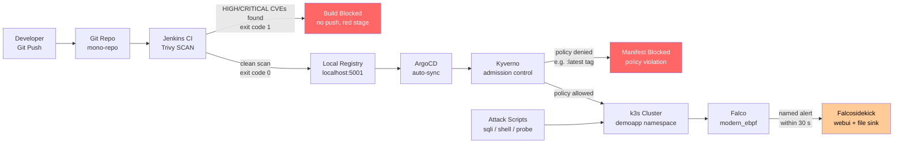

<objective>
Write `docs/architecture.md` (Mermaid component diagram with three security layers and data flow) and `docs/DEMO-SCRIPT.md` (line-by-line thesis defence script). The architecture doc targets committee members browsing the GitHub repo; the demo script is a printed cheat-sheet for the presenter.

Purpose: DOCS-03 and thesis defence preparation (DEMO-SCRIPT.md is non-required but high-value).

Output: `docs/architecture.md` and `docs/DEMO-SCRIPT.md`.
</objective>

<execution_context>
@$HOME/.claude/get-shit-done/workflows/execute-plan.md
@$HOME/.claude/get-shit-done/templates/summary.md
</execution_context>

<context>
@.planning/PROJECT.md
@.planning/STATE.md
@.planning/phases/06-demo-polish/06-RESEARCH.md
</context>

<tasks>

<task type="auto">
  <name>Task 1: Write docs/architecture.md — Mermaid component diagram</name>
  <read_first>.planning/phases/06-demo-polish/06-RESEARCH.md, CLAUDE.md</read_first>
  <files>docs/architecture.md</files>
  <action>
Write `docs/architecture.md` with the following content. The Mermaid diagram must render on GitHub. Use `flowchart LR` syntax.

---

```markdown
# Architecture — DevSecOps Pipeline

**Thesis:** DevSecOps CI/CD Pipeline for Automated Vulnerability Detection and Runtime Security  
**Institution:** ТУ-София (TU-Sofia), катедра "Киберсигурност"

---

## Three Security Control Layers

This pipeline demonstrates three complementary security layers:

| Layer | Tool | When | What It Prevents |
|-------|------|------|-----------------|
| Shift-Left | Trivy (in Jenkins) | At build time | Vulnerable images reaching the registry |
| GitOps Policy | Kyverno (admission) | At deploy time | Non-compliant manifests reaching the cluster |
| Runtime Detection | Falco (in cluster) | At runtime | Attacks against running containers go undetected |

---

## Component Diagram



---

## Data Flow

```
Developer pushes code
    │
    ▼
Git Repo (mono-repo)
    │
    ├── Jenkins polls SCM (every 60 s)
    │       │
    │       ├── [SCAN fails] ─── Trivy exit 1 ─── Pipeline RED, no push
    │       │
    │       └── [SCAN passes]
    │               │
    │               ├── PUSH stage: image → localhost:5001/demoapp:<sha>
    │               │
    │               └── BUMP stage: updates deploy/overlays/local/demoapp-patch.yaml
    │                       └── git commit "ci: bump demoapp to <sha> [skip ci]"
    │
    └── ArgoCD watches deploy/overlays/local/ (auto-sync, 30 s interval)
            │
            ├── Kyverno admission webhook intercepts every pod/deployment
            │       ├── disallow-latest-tag
            │       ├── restrict-image-registries (allow only host.rancher-desktop.internal:5001)
            │       ├── disallow-privileged-containers
            │       └── require-resource-limits
            │
            └── Pod running in demoapp namespace
                    │
                    └── Falco DaemonSet (modern_ebpf) monitors all syscalls
                            │
                            └── Custom rules (scoped: k8s.ns.name = "demoapp")
                                    └── Falcosidekick → webui (localhost:2802) + file (/var/log/falco/events.log)
```

---

## Network Topology

```
┌─────────────────────────────────────────────────────────────────────┐
│  Host (Windows 10/11)                                                │
│                                                                      │
│  ┌──────────────────────────────────────────────────────────────┐   │
│  │  Rancher Desktop VM (WSL2 / Lima)                            │   │
│  │                                                              │   │
│  │  ┌─────────────────────────────────────────────────────┐    │   │
│  │  │  k3s Cluster                                         │    │   │
│  │  │                                                      │    │   │
│  │  │  namespace: argocd   ── ArgoCD controller            │    │   │
│  │  │  namespace: kyverno  ── Kyverno admission webhook    │    │   │
│  │  │  namespace: falco    ── Falco DaemonSet              │    │   │
│  │  │                         Falcosidekick (webui :2802)  │    │   │
│  │  │  namespace: demoapp  ── REST API pod (NodePort)       │    │   │
│  │  │                                                      │    │   │
│  │  └─────────────────────────────────────────────────────┘    │   │
│  │                                                              │   │
│  │  host.rancher-desktop.internal ─── resolves to VM host IP   │   │
│  │                                                              │   │
│  └──────────────────────────────────────────────────────────┘   │   │
│                                                                      │
│  Docker registry:2  → localhost:5001  (host port, TCP)              │
│  Jenkins controller → localhost:8080  (host port, TCP)              │
│  Falcosidekick UI   → localhost:2802  (kubectl port-forward)         │
│  ArgoCD UI          → localhost:8443  (kubectl port-forward)         │
│                                                                      │
└─────────────────────────────────────────────────────────────────────┘
```

> **Registry hostname rule:**  
> - Push from host: `localhost:5001`  
> - Pull inside k3s: `host.rancher-desktop.internal:5001`  
> Never hardcode an IP — DHCP changes it on every network roam.

---

## Key Design Decisions

| Decision | Choice | Why |
|----------|--------|-----|
| Falco eBPF driver | `driver.kind=modern_ebpf` (explicit) | Rancher Desktop VM has no kernel headers; kmod fails. BTF-based driver works. |
| Registry port | 5001 (not 5000) | Rancher Desktop binds 5000 internally; 5001 avoids the conflict |
| Jenkins config | JCasC from day 1 | Reproducible; avoids opaque UI wizard state; `casc.yaml` in Git |
| GitOps rule | Jenkins commits to Git only; never `kubectl apply` | Bypassing ArgoCD turns GitOps into decoration |
| Kyverno policies | 4 community policies | YAML policies more legible than Rego for a thesis committee |
```

---

Write this content to `docs/architecture.md`.
  </action>
  <verify>
    <automated>grep -q "flowchart" docs/architecture.md &amp;&amp; grep -q "Trivy" docs/architecture.md &amp;&amp; grep -q "Falco" docs/architecture.md &amp;&amp; grep -q "Kyverno" docs/architecture.md &amp;&amp; echo "PASS" || echo "FAIL"</automated>
  </verify>
  <acceptance_criteria>
    - `grep "flowchart" docs/architecture.md` exits 0 (Mermaid diagram present)
    - `grep "Jenkins" docs/architecture.md` exits 0
    - `grep "ArgoCD" docs/architecture.md` exits 0
    - `grep "Kyverno" docs/architecture.md` exits 0
    - `grep "Falco" docs/architecture.md` exits 0
    - `grep "5001" docs/architecture.md` exits 0 (correct registry port)
    - `grep "modern_ebpf" docs/architecture.md` exits 0
    - `wc -l docs/architecture.md` reports more than 80 lines
  </acceptance_criteria>
  <done>docs/architecture.md exists with Mermaid flowchart, data flow ASCII diagram, network topology ASCII diagram, and key decisions table</done>
</task>

<task type="auto">
  <name>Task 2: Write docs/DEMO-SCRIPT.md — thesis committee presentation script</name>
  <read_first>.planning/phases/06-demo-polish/06-RESEARCH.md, docs/scenarios.md</read_first>
  <files>docs/DEMO-SCRIPT.md</files>
  <action>
Write `docs/DEMO-SCRIPT.md`. This is the line-by-line script for the presenter — what to say, what to click, what to show, what to expect. Format is concise: paragraph introduction, numbered action steps, then pass/fail check. Include Bulgarian-friendly terminology where relevant.

---

```markdown
# Demo Script — Thesis Committee Presentation

**Thesis title:** DevSecOps CI/CD Pipeline for Automated Vulnerability Detection and Runtime Security  
**Total demo time:** ~15 minutes (3 scenarios × 4–5 min each)  
**Institution:** ТУ-София, катедра "Киберсигурност"

---

## Pre-Demo Checklist (Run BEFORE the committee sits down)

```bash
make demo-warmup
```

Wait for: `✓ Stack warm. Ready for demo.`

Also open these in separate browser tabs (do this now — not during the demo):
- Jenkins: http://localhost:8080
- ArgoCD: https://localhost:8443 (accept the self-signed cert warning)
- Falcosidekick UI: http://localhost:2802 (start port-forward: `kubectl port-forward svc/falco-falcosidekick-ui -n falco 2802:2802`)

Have a terminal ready. Demo is sequential — run Scenario 1 first, then 2, then 3.

---

## Scenario 1: Shift-Left Security — Blocked Build (~4 minutes)

**Говорете:** (What to say)  
*"Първият защитен слой е shift-left сигурността. Trivy сканира контейнерния образ по време на build в Jenkins — преди да бъде изпратен в регистъра."*  
*"The first security layer is shift-left. Trivy scans the container image at build time in Jenkins — before it is ever pushed to the registry."*

**Step 1 — Run the demo:**
```bash
make demo-1
```

**Step 2 — Wait:** ~2–4 minutes. Jenkins builds and runs Trivy.

**Step 3 — Show in Jenkins UI:**  
Point at the pipeline view. The **SCAN stage is red**. The PUSH and BUMP stages are greyed out.

**Step 4 — Show CVE output:**  
Click the failed build → Console Output. Scroll to the Trivy table showing HIGH and CRITICAL CVEs.

**Step 5 — Prove the image was NOT pushed:**
```bash
curl -s http://localhost:5001/v2/demoapp/tags/list
```
Output shows only the old tag. No new SHA was added.

**Say:** *"The pipeline failed at the SCAN stage. The vulnerable image never touched the registry. No deployment was possible."*

**Pass check:** Jenkins build status = FAILURE, SCAN stage red, no new image tag in registry.

---

## Scenario 2: GitOps Pipeline — Successful Deploy (~5 minutes)

**Говорете:**  
*"Вторият слой — GitOps с ArgoCD и Kyverno. При чист образ, целият pipeline е зелен и ArgoCD автоматично синхронизира промяната в клъстера."*  
*"The second layer is GitOps: ArgoCD and Kyverno. With a clean image, the entire pipeline goes green and ArgoCD automatically syncs the change to the cluster."*

**Step 1 — Run the demo:**
```bash
make demo-2
```

**Step 2 — Wait:** ~4–6 minutes. Jenkins build + ArgoCD sync.

**Step 3 — Show in Jenkins UI:**  
All 4 stages green: **BUILD → SCAN → PUSH → BUMP**.

**Step 4 — Show the Git commit:**
```bash
git log --oneline -3
```
The top commit is: `ci: bump demoapp to <sha> [skip ci]` — written by Jenkins, never by a human running `kubectl`.

**Step 5 — Show in ArgoCD UI:**  
Application `demoapp` shows **Synced / Healthy**. Click the app → the new pod SHA is visible.

**Step 6 — Show Kyverno PolicyReport (optional bonus):**
```bash
kubectl get policyreport -n demoapp -o wide
```
Shows the 4 policies evaluated the new pod and accepted it (SHA tag, not `:latest`).

**Say:** *"Jenkins never ran kubectl apply. ArgoCD is the only entity that touches the cluster. This is the GitOps boundary."*

**Pass check:** 4 green stages, bump commit in git log, new pod SHA in ArgoCD.

---

## Scenario 3: Runtime Security — Live Attack Detected (~3 minutes)

**Говорете:**  
*"Третият слой — runtime детекция с Falco. Дори ако атакуващ достигне до работещия контейнер, Falco засича системните извиквания и генерира именувани предупреждения."*  
*"The third layer is runtime detection with Falco. Even if an attacker reaches the running container, Falco detects the syscalls and generates named alerts."*

> **IMPORTANT:** Wait for Scenario 2 to fully complete before starting Scenario 3.

**Step 1 — Prepare the Falcosidekick UI:**  
Switch to the browser tab with http://localhost:2802. The events list should currently be empty (or have old events).

**Step 2 — Run the demo:**
```bash
make demo-3
```

**Step 3 — Watch the Falcosidekick UI in real time:**  
Within ~5–10 seconds of each attack script running, alerts appear in the webui. Point at:
- `reverse-shell` or `shell-from-webapp` alert (from `reverse_shell.sh`)
- `read-sensitive-file` alert (from `privilege_probe.sh` — `cat /etc/shadow`)
- `package-management-in-container` alert (from `privilege_probe.sh` — `apk add curl`)

**Step 4 — Show the log file:**
```bash
tail -20 logs/falco.log
```
Shows the JSON-structured alert events, timestamped, persisted.

**Step 5 — Show namespace scoping (optional bonus):**
```bash
kubectl logs -n falco -l app.kubernetes.io/name=falco --tail=30 | grep "rule\|demoapp"
```
Only `demoapp` namespace events appear — ArgoCD/kube-system generate zero alerts.

**Say:** *"Three distinct attacks, three named Falco rules, all alerts within 30 seconds — and they are persisted to the log file even after the pod restarts."*

**Pass check:** ≥3 distinct rule names in Falcosidekick webui, `logs/falco.log` contains events with `k8s.ns.name: demoapp`.

---

## Fallback Procedures

### If Jenkins build takes more than 10 minutes

Jenkins may be waiting for the agent to provision. Check:
```bash
docker logs jenkins-controller 2>&1 | tail -20
```
If the agent is not connecting, restart: `make reset-jenkins && make demo-1`

### If Falcosidekick webui is blank during demo-3

Port-forward may have dropped. Restart in a new terminal:
```bash
kubectl port-forward svc/falco-falcosidekick-ui -n falco 2802:2802
```
The log file is the primary evidence: `tail -20 logs/falco.log`

### If ArgoCD does not sync after demo-2

Force a sync:
```bash
kubectl annotate application demoapp -n argocd argocd.argoproj.io/refresh=hard
```

---

## Questions to Expect from the Committee

**Q: Защо не използвате cloud provider?**  
A: Thesis is designed for local reproducibility. The architecture maps directly to any cloud CI/CD — the tools (Jenkins, ArgoCD, Falco) are cloud-native and deployed the same way in production.

**Q: Trivy ли е достатъчен за production?**  
A: Trivy covers OS packages, language dependencies, and IaC misconfigs. For a production pipeline, you would add SBOM signing (Cosign) and SBOM diffing — the foundation demonstrated here is the same.

**Q: Как Falco знае кой процес е опасен?**  
A: Falco uses eBPF to hook syscalls at the kernel level. The custom rules define conditions (e.g., `proc.name = bash AND proc.pname = node`) that signal anomalous behaviour. All rules are scoped to the `demoapp` namespace to prevent false positives.
```

---

Write this content to `docs/DEMO-SCRIPT.md`.
  </action>
  <verify>
    <automated>grep -q "make demo-warmup" docs/DEMO-SCRIPT.md &amp;&amp; grep -q "make demo-1" docs/DEMO-SCRIPT.md &amp;&amp; grep -q "make demo-2" docs/DEMO-SCRIPT.md &amp;&amp; grep -q "make demo-3" docs/DEMO-SCRIPT.md &amp;&amp; echo "PASS" || echo "FAIL"</automated>
  </verify>
  <acceptance_criteria>
    - `grep "make demo-warmup" docs/DEMO-SCRIPT.md` exits 0 (pre-demo checklist)
    - `grep "make demo-1" docs/DEMO-SCRIPT.md` exits 0
    - `grep "make demo-2" docs/DEMO-SCRIPT.md` exits 0
    - `grep "make demo-3" docs/DEMO-SCRIPT.md` exits 0
    - `grep "Falcosidekick\|falco.log" docs/DEMO-SCRIPT.md` exits 0
    - `grep "Fallback\|fallback" docs/DEMO-SCRIPT.md` exits 0 (fallback procedures present)
    - `wc -l docs/DEMO-SCRIPT.md` reports more than 100 lines
  </acceptance_criteria>
  <done>docs/DEMO-SCRIPT.md exists with pre-demo checklist, line-by-line scripts for all 3 scenarios, fallback procedures, and expected committee questions</done>
</task>

</tasks>

<verification>
```bash
grep -q "flowchart" docs/architecture.md && echo "architecture.md Mermaid OK"
grep -q "5001" docs/architecture.md && echo "architecture.md port OK"
grep -q "make demo-warmup" docs/DEMO-SCRIPT.md && echo "DEMO-SCRIPT.md warmup OK"
ls -la docs/
```
</verification>

<success_criteria>
1. `docs/architecture.md` exists with Mermaid flowchart referencing Jenkins/ArgoCD/Kyverno/Falco/Registry, data flow diagram, and network topology
2. `docs/DEMO-SCRIPT.md` exists with all 3 scenario scripts, pre-demo warmup step, and fallback procedures
</success_criteria>

<output>
After completion, create `.planning/phases/06-demo-polish/06-03-SUMMARY.md`
</output>
