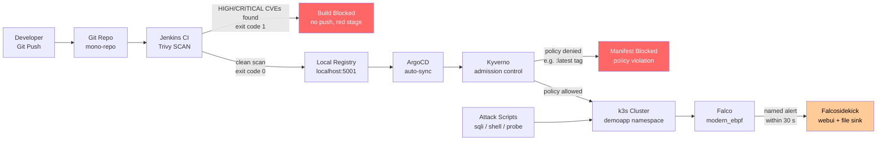

# Architecture — DevSecOps Pipeline

**Thesis:** DevSecOps CI/CD Pipeline for Automated Vulnerability Detection and Runtime Security  
**Institution:** ТУ-София (TU-Sofia), катедра "Киберсигурност"

---

## Three Security Control Layers

This pipeline demonstrates three complementary security layers:

| Layer | Tool | When | What It Prevents |
|-------|------|------|-----------------|
| Shift-Left | Trivy (in Jenkins) | At build time | Vulnerable images reaching the registry |
| GitOps Policy | Kyverno (admission) | At deploy time | Non-compliant manifests reaching the cluster |
| Runtime Detection | Falco (in cluster) | At runtime | Attacks against running containers go undetected |

---

## Component Diagram



---

## Data Flow

```
Developer pushes code
    │
    ▼
Git Repo (mono-repo)
    │
    ├── Jenkins polls SCM (every 60 s)
    │       │
    │       ├── [SCAN fails] ─── Trivy exit 1 ─── Pipeline RED, no push
    │       │
    │       └── [SCAN passes]
    │               │
    │               ├── PUSH stage: image → localhost:5001/demoapp:<sha>
    │               │
    │               └── BUMP stage: updates deploy/overlays/local/demoapp-patch.yaml
    │                       └── git commit "ci: bump demoapp to <sha> [skip ci]"
    │
    └── ArgoCD watches deploy/overlays/local/ (auto-sync, 30 s interval)
            │
            ├── Kyverno admission webhook intercepts every pod/deployment
            │       ├── disallow-latest-tag
            │       ├── restrict-image-registries (allow only host.rancher-desktop.internal:5001)
            │       ├── disallow-privileged-containers
            │       └── require-resource-limits
            │
            └── Pod running in demoapp namespace
                    │
                    └── Falco DaemonSet (modern_ebpf) monitors all syscalls
                            │
                            └── Custom rules (scoped: k8s.ns.name = "demoapp")
                                    └── Falcosidekick → webui (localhost:2802) + file (/var/log/falco/events.log)
```

---

## Network Topology

```
┌─────────────────────────────────────────────────────────────────────┐
│  Host (Windows 10/11)                                                │
│                                                                      │
│  ┌──────────────────────────────────────────────────────────────┐   │
│  │  Rancher Desktop VM (WSL2 / Lima)                            │   │
│  │                                                              │   │
│  │  ┌─────────────────────────────────────────────────────┐    │   │
│  │  │  k3s Cluster                                         │    │   │
│  │  │                                                      │    │   │
│  │  │  namespace: argocd   ── ArgoCD controller            │    │   │
│  │  │  namespace: kyverno  ── Kyverno admission webhook    │    │   │
│  │  │  namespace: falco    ── Falco DaemonSet              │    │   │
│  │  │                         Falcosidekick (webui :2802)  │    │   │
│  │  │  namespace: demoapp  ── REST API pod (NodePort)       │    │   │
│  │  │                                                      │    │   │
│  │  └─────────────────────────────────────────────────────┘    │   │
│  │                                                              │   │
│  │  host.rancher-desktop.internal ─── resolves to VM host IP   │   │
│  │                                                              │   │
│  └──────────────────────────────────────────────────────────┘   │   │
│                                                                      │
│  Docker registry:2  → localhost:5001  (host port, TCP)              │
│  Jenkins controller → localhost:8080  (host port, TCP)              │
│  Falcosidekick UI   → localhost:2802  (kubectl port-forward)         │
│  ArgoCD UI          → localhost:8443  (kubectl port-forward)         │
│                                                                      │
└─────────────────────────────────────────────────────────────────────┘
```

> **Registry hostname rule:**  
> - Push from host: `localhost:5001`  
> - Pull inside k3s: `host.rancher-desktop.internal:5001`  
> Never hardcode an IP — DHCP changes it on every network roam.

---

## Key Design Decisions

| Decision | Choice | Why |
|----------|--------|-----|
| Falco eBPF driver | `driver.kind=modern_ebpf` (explicit) | Rancher Desktop VM has no kernel headers; kmod fails. BTF-based driver works. |
| Registry port | 5001 (not 5000) | Rancher Desktop binds 5000 internally; 5001 avoids the conflict |
| Jenkins config | JCasC from day 1 | Reproducible; avoids opaque UI wizard state; `casc.yaml` in Git |
| GitOps rule | Jenkins commits to Git only; never `kubectl apply` | Bypassing ArgoCD turns GitOps into decoration |
| Kyverno policies | 4 community policies | YAML policies more legible than Rego for a thesis committee |
